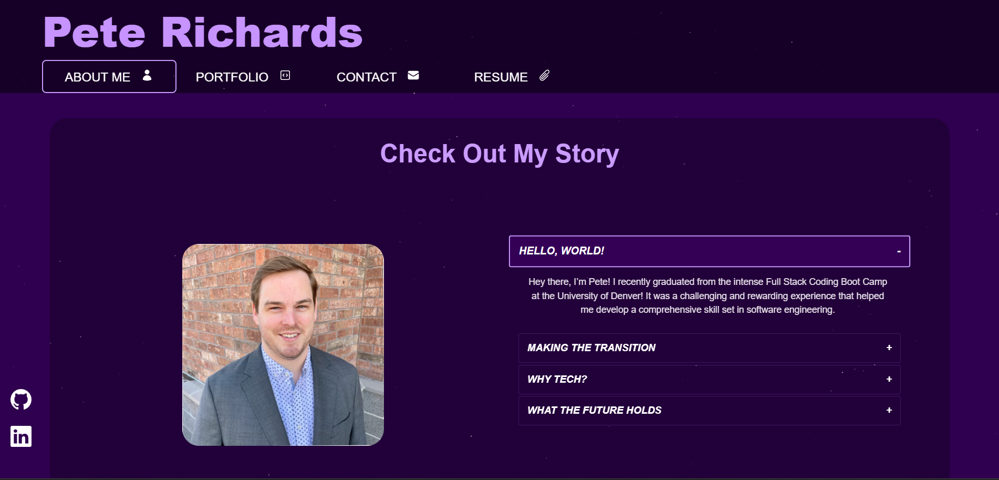

# Pete's React Portfolio

## Description

  Welcome to my portfolio! I'm Pete Richards, a Software Developer currently enrolled in the University of Denver's Coding Boot Camp. My portfolio provides a snapshot of my coding journey, skills, and experiences. It's built using React and serves as a guide to who I am as a developer.

  To visit my portfolio click [here!](#)

## Table of Contents

  - [Installation](#installation)
  - [Usage](#usage)
  - [Mock-Up](#mock-up)
  - [License](#license)
  - [Contributing](#contributing)
  - [Credits](#credits)

## Installation

  N/A

## Usage

  Follow the instructions below to navigate through Pete's Portfolio:

  ##### Navigation
  
  - Easily navigate between my About Me, Portfolio, Contact, and Resume pages using the navigation bar at the top of the page 
  - Your current location will always be highlighted in the navigation bar so you never have to wonder which page you're on
  - If you look to the bottom left of any page you will also find links to my GitHub, LinkedIn, and Spotify accounts

  ##### About Me

  On the homepage, you'll find an 'About Me' section designed to give you a snapshot of who I am both as a developer and a person. This area features not only a brief summary of my coding journey, but also a recent photograph to offer a more personal glimpse into the person behind the code. As you explore the rest of my portfolio, I hope this introduction provides a meaningful context for the work and skills you'll encounter.

  ##### Portfolio

  - Click "Portfolio" in the navigation bar to be taken to the Portfolio page, where I highlight 6 of my projects.
  - Scroll through my projects to view their respective screenshots, titles, descriptions and links to their live sites and GitHub repositories.

  ##### Contact

  - On the Contact page, you'll find a form with fields for Name, Email Address, and Message
  - Each field must be filled out before submitting
  - If the email address isn't properly formatted (Ex: example@email.com) the form cannot be submitted
  - Upon submitting the information, a success or failure message will be displayed on the screen for 3 seconds
  - If the success message appears, I will receive an email from you and will respond promptly
  - If an error message appears, verify your information was entered correctly and try again

  ##### Resume
  
  - The Resume page shows an image of my current resume
  - To download a PDF version, simply click the image and a new browser tab will open where it can be downloaded

## Mock-Up

  The following video shows the application's design and functionality.

  

## License

  N/A

## Contributing

  N/A
